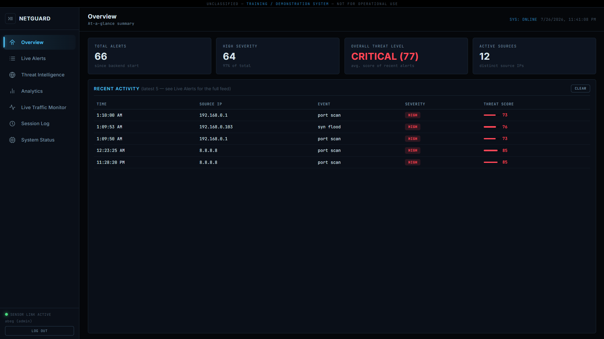
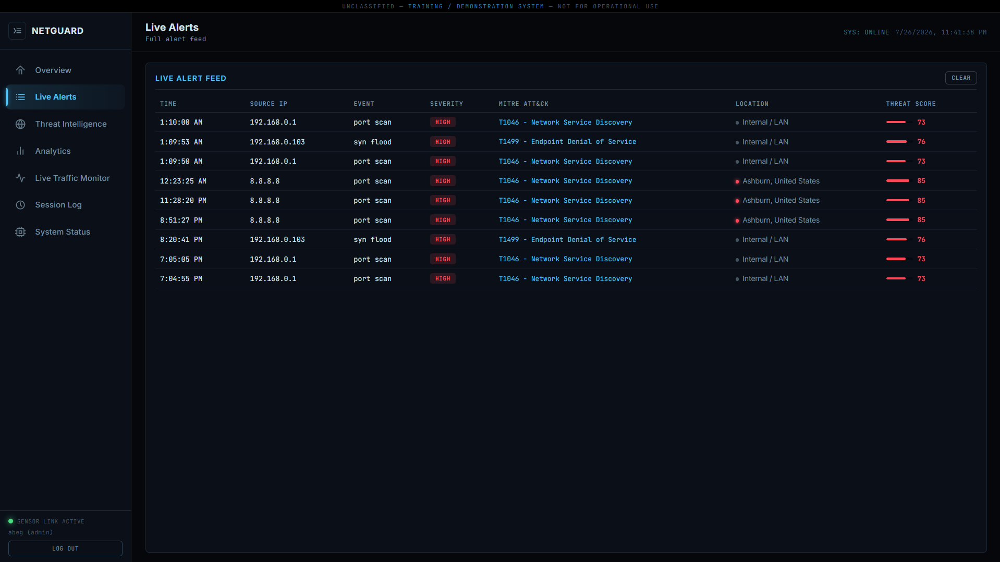
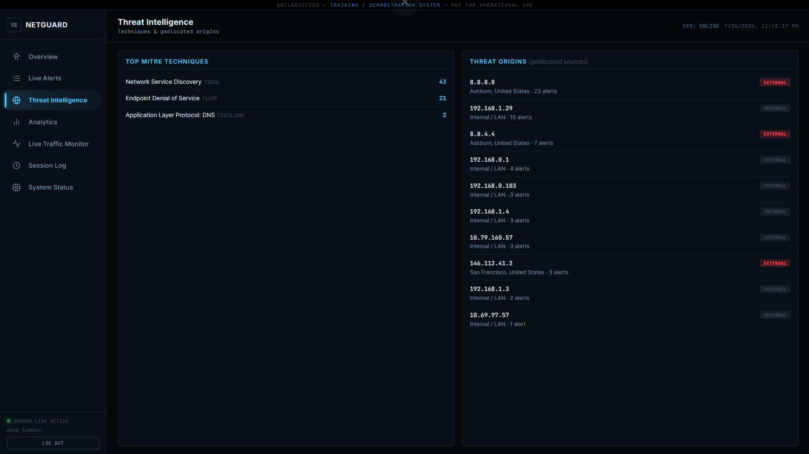
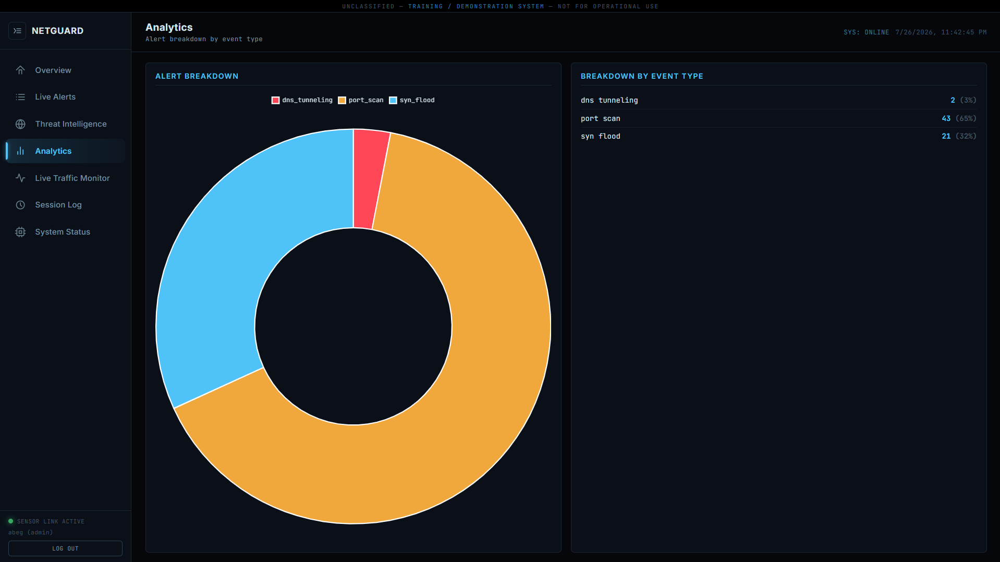

<div align="center">

# 🛡️ Network-based SIEM Monitor (NETGUARD)

### Enterprise Threat Telemetry, Behavioral Detection & SOC Dashboard


**[Overview](#-executive-summary) • [Features](#-key-features) • [Architecture](#-system-architecture) • [Simulators](#-attack-simulators) • [Installation](#-installation) • [API Docs](#-api-reference)**

</div>

---

##  Executive Summary

**NETGUARD** is a self-hosted SOC (Security Operations Center) management and threat analysis platform. It combines a custom low-level packet-capture sensor with continuous stream ingestion, automated MITRE ATT&CK mapping, heuristic threat scoring, and real-time incident visualization into a single control plane.

A C++ sensor built on raw WinSock2 and Npcap captures live network traffic, runs it through 8 detection modules (signature-based and anomaly-based), and streams verified alerts to a Node.js backend — which enriches, stores, and pushes them live to a browser-based SOC dashboard over WebSockets.

Every remediation action shown in the dashboard is a **human-authorized recommendation only** — nothing is ever executed against a real firewall, router, or network device.

---

##  Key Features

- **Live Telemetry Engine** — event streaming powered by WebSockets (`Socket.io`) for low-latency incident visualization across every connected dashboard session.
- **8-Module Detection Engine** — port scanning, SYN flood, ICMP flood, stealth scans (NULL/FIN/XMAS), admin-port brute force, DNS-tunneling heuristic, anomalous packet size (EMA-baseline anomaly detection), and known-bad IP matching.
- **MITRE ATT&CK Mapping Engine** — automated correlation between raw event signatures and standard TTP (Tactics, Techniques & Procedures) framework identifiers.
- **IP Geolocation** — every external alert is enriched with country/city origin data.
- **Multi-Tier SOC Policy Model** — granular severity triage matrix (High / Medium / Low) with designated response SLAs for incident handling.
- **Authenticated Access Control** — bcrypt-hashed credentials, persistent "Remember Me" sessions, and enforced Admin/Viewer RBAC at the API layer, not just the UI.
- **Simulated Remediation ("Authorize-to-Act")** — high-severity alerts surface a recommended response; only an authorized admin can approve or dismiss it, and the action is recorded, never executed.
- **Real-Time Visual Control Plane** — a custom dark-mode SOC dashboard providing live alert feeds, threat-origin maps, analytics breakdowns, session audit history, and system status, all in one view.

---

##  Dashboard Preview

<table>
<tr>
<td width="50%"><br><sub>Overview</sub></td>
<td width="50%"><br><sub>Live Alert Feed</sub></td>
</tr>
<tr>
<td width="50%"><br><sub>Threat Intelligence</sub></td>
<td width="50%"><br><sub>Analytics</sub></td>
</tr>
</table>

<div align="center">
<sub>See <a href="docs/screenshots">docs/screenshots</a> for the full set, including login, traffic monitor, session log, and system status.</sub>
</div>

---

##  System Architecture

```
┌──────────────────┐     HTTP POST      ┌───────────────────┐     Socket.io      ┌───────────────────┐
│   ids_real.cpp     │ ─────────────────► │     server.js       │ ─────────────────► │    index.html       │
│  C++ sensor          │  /api/alerts        │  Node + Express      │   live push           │  SOC dashboard        │
│  WinSock2 / Npcap    │  /api/traffic       │  + Socket.io          │                       │  vanilla JS            │
└──────────────────┘                    └──────────┬────────┘                    └───────────────────┘
                                                     │ mysql2
                                                     ▼
                                          ┌────────────────────┐
                                          │  MySQL / MariaDB      │
                                          │  (via XAMPP)            │
                                          └────────────────────┘
```

Full breakdown of detection-rule logic, auth design, and the remediation/clear-cursor systems: **[docs/ARCHITECTURE.md](docs/ARCHITECTURE.md)**

---

##  Attack Simulators

The `sensor/` module doubles as its own test harness — point it at a bridged VM (e.g. Kali Linux) running standard tools to trigger each detection module live:

| Simulated Attack | Tool Example | Detection Module |
|---|---|---|
| Port Scan | `nmap -sS` | `port_scan` |
| SYN Flood | `hping3 --flood` | `syn_flood` |
| Stealth Scans | `nmap -sN` / `-sF` / `-sX` | `stealth_scan_*` |
| Brute Force | `hydra` against port 22/23/3389 | `brute_force_admin` |
| DNS Tunneling | `dnscat2` / oversized DNS queries | `dns_tunneling` |

---

##  Installation

### Prerequisites
- Windows + [XAMPP](https://www.apachefriends.org/) (MySQL/MariaDB)
- [Node.js](https://nodejs.org/) v18+
- MinGW g++ and the [Npcap SDK](https://npcap.com/#download) (WpdPack)

### 1. Database
Create a `netguard` database in phpMyAdmin, then run everything in `database/` in numeric order.

### 2. Backend
```bash
cd backend
npm install
npm start
```
Dashboard: **http://localhost:8000**

### 3. Sensor
```bash
cd sensor
g++ ids_real.cpp -o ids_real.exe -IC:\WpdPack\Include -LC:\WpdPack\Lib\x64 -lwpcap -lPacket -lws2_32
./ids_real.exe
```

>  Training/demonstration system — not hardened for production or internet-facing deployment.

---

##  API Reference

| Method | Endpoint | Auth | Description |
|---|---|---|---|
| `POST` | `/api/register` | — | Create a `viewer` account |
| `POST` | `/api/auth/login` | — | Log in, optional `rememberMe` |
| `GET` | `/api/auth/me` | Session | Current logged-in user |
| `POST` | `/api/auth/logout` | Session | Revoke session + remember token |
| `POST` | `/api/alerts` | — (sensor) | Ingest a new alert |
| `GET` | `/api/alerts` | Auth | Full alert history |
| `POST` | `/api/alerts/:id/authorize` | Admin | Authorize a recommended action |
| `POST` | `/api/alerts/:id/dismiss` | Admin | Dismiss a recommended action |
| `GET` | `/api/traffic` | Auth | Recent traffic samples |
| `GET` | `/api/stats` | Auth | Alert counts by event type |
| `GET` | `/api/sessions` | Auth | Backend run history |
| `GET` / `POST` | `/api/clears` | Auth | Per-user view clear cursors |

---

##  Roadmap

- [x] Simulated Remediation (Authorize-to-Act)
- [x] Full auth system (register / login / session / RBAC)
- [x] Per-user Clear-button persistence
- [x] Session Log live alert counts
- [ ] Acknowledge / Unacknowledge button on alerts *(active next step)*
- [ ] Alert feed filtering & search
- [ ] Audit log of who acknowledged/authorized what

Detailed dev-continuity notes: **[docs/HANDOFF.md](docs/HANDOFF.md)**

---

##  Tech Stack

`C++` `WinSock2` `Npcap` · `Node.js` `Express` `Socket.io` `mysql2` `bcryptjs` · `MySQL / MariaDB` · `HTML` `CSS` `Vanilla JS`

---

## 📄 License

MIT — see [LICENSE](LICENSE)

## ✍️ Author

**Ragib Shahriar Abeg**  
Cyber Security Engineering Student   
University of Frontier Technology, Bangladesh    

<p>
<a href="https://www.linkedin.com/in/rsabeg/">

</a>
